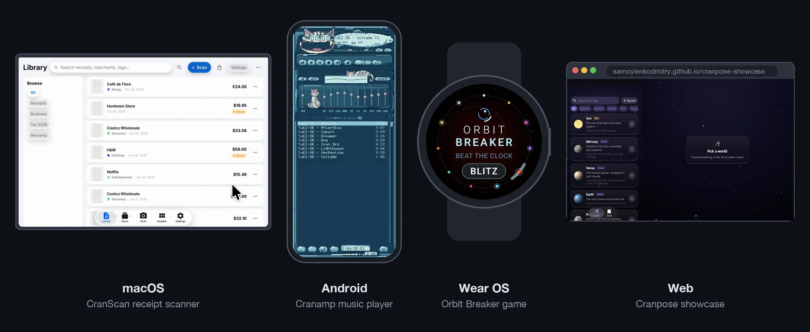

# Cranpose

[](https://crates.io/crates/cranpose)
[](https://docs.rs/cranpose/latest/cranpose/)
[](https://github.com/samoylenkodmitry/Cranpose/actions/workflows/rust.yml)
[](#license)

**[Try the showcase in your browser](https://samoylenkodmitry.github.io/cranpose-showcase/)**

Cranpose brings the Jetpack Compose model to Rust. Composable functions describe
the UI. State changes trigger recomposition. Modifiers control layout, input and
graphics. Cranpose supplies the platform window and device services.

Use the same Rust UI on Linux, macOS, Windows, Android, Wear OS, iOS and the web.
Add Cranpose screens to an existing Android Compose or UIKit app, or place native
controls inside a Cranpose screen.

[Cranpose Guide](https://samoylenkodmitry.github.io/Cranpose/?tab=guide) ·
[Performance results](https://samoylenkodmitry.github.io/Cranpose/?tab=performance) ·
[API reference](https://docs.rs/cranpose/latest/cranpose/) ·
[Project template](https://github.com/samoylenkodmitry/cranpose-showcase) ·
[Releases](https://github.com/samoylenkodmitry/Cranpose/releases) ·
[Discussions](https://github.com/samoylenkodmitry/Cranpose/discussions)



On a Huawei Mate 20 X from 2018, the [gauntlet benchmark](benchmarks/compose-vs-cranpose/README.md)
draws 53 frames per second in Cranpose and 4.5 in Jetpack Compose. Both apps
show the same UI, element for element. Cranpose spends 30 ms of CPU time per
frame and Compose 294 ms. These numbers come from the nightly run of 8 October
2026 at tier 12. The [Performance tab](https://samoylenkodmitry.github.io/Cranpose/?tab=performance)
shows the latest run, with Flutter, React Native, egui, Slint and other
frameworks on the same phone and on a Mac.

## Apps built with Cranpose

| App | Platforms | Get it |
| --- | --- | --- |
| [Cranamp](https://github.com/samoylenkodmitry/cranamp), a music player with pixel skins and a skin editor | Windows, macOS, Linux, Android, iOS, web | [Google Play](https://play.google.com/store/apps/details?id=com.cranamp.app), [App Store](https://apps.apple.com/app/id6818451356), [browser](https://samoylenkodmitry.github.io/cranamp/) |
| CranScan, a document and receipt scanner with on-device text recognition | Android, iOS | [Google Play](https://play.google.com/store/apps/details?id=com.cranscan.app), [App Store](https://apps.apple.com/app/id6795579921) |
| Orbit Breaker, a brick-breaking game for round Wear OS watches | Wear OS | [Google Play](https://play.google.com/store/apps/details?id=com.dmitry.orbitbreaker) |

## Start an app

Install Rust with [rustup](https://rustup.rs/). Cargo builds Rust packages and
resolves dependencies. `Cargo.toml` serves the role of a Gradle build file.

The [Cranpose plugin for IntelliJ IDEA and RustRover](https://plugins.jetbrains.com/plugin/34594-cranpose)
includes the project template. Choose **File → New Project → Cranpose**. The
plugin provides live previews, reload after source edits, a layout inspector and
recomposition hints. See the [IDE guide](docs/intellij.md) for controls and shortcuts.

For a terminal workflow, clone the same template:

```sh
git clone https://github.com/samoylenkodmitry/cranpose-showcase.git my-app
cd my-app
cargo run --features desktop,renderer-wgpu
```

Replace the sample screens in `src/screens`. The template places data access in
`src/data` and view models in `src/presentation`. Android Gradle files, iOS scripts
and a web build script share the Rust UI.

[Run the showcase](https://samoylenkodmitry.github.io/cranpose-showcase/) to explore
the template's navigation, adaptive layout and Liquid components.

## Write a composable

For an app with one source file, create a Cargo package:

```sh
cargo new counter
cd counter
cargo add cranpose --features desktop,renderer-wgpu
cargo add anyhow
```

Replace `src/main.rs` with:

```rust
use cranpose::prelude::*;

#[composable]
fn Counter() {
    let count = rememberMutableStateOf(|| 0);

    Column(
        Modifier::empty().padding(24.0),
        ColumnSpec::default().vertical_arrangement(LinearArrangement::spaced_by(12.0)),
        move || {
            Text(
                format!("Count: {}", count.get()),
                Modifier::empty(),
                TextStyle::default(),
            );
            Button(
                Modifier::empty().height(48.0),
                ButtonSpec::default(),
                move || count.update(|value| *value += 1),
                || {
                    Text("Increment", Modifier::empty(), TextStyle::default());
                },
            );
        },
    );
}

fn main() -> anyhow::Result<()> {
    AppLauncher::new()
        .with_title("Counter")
        .with_size(360, 240)
        .try_run(Counter)?;
    Ok(())
}
```

Run `cargo run`. `rememberMutableStateOf` preserves the counter across
recomposition. The button callback updates the value. `count` is a copyable state
handle, so both closures use the same state.

## Apply Compose knowledge

| Jetpack Compose | Cranpose |
| --- | --- |
| `@Composable fun Screen()` | `#[composable] fn Screen()` |
| `remember { mutableStateOf(0) }` | `rememberMutableStateOf(|| 0)` |
| `count.value` | `count.get()`, `count.set(value)`, `count.update(...)` |
| `Modifier.padding(16.dp)` | `Modifier::empty().padding(16.0)` |
| `Column { ... }` | `Column(modifier, spec, move || { ... })` |
| `LaunchedEffect(key)` | `LaunchedEffect` or `LaunchedEffectAsync` |
| `StateFlow.collectAsStateWithLifecycle()` | `StateFlowCollect::collectAsStateWithLifecycle()` |
| `CompositionLocalProvider` | `CompositionLocalProvider` |

Rust closures serve as content lambdas. Specs hold component options. The guide
covers [ownership](docs/guide.md#ownership), [state](docs/guide.md#state),
[flows](docs/guide.md#flows), [view models](docs/guide.md#view-models),
[shared state across threads](docs/guide.md#shared-app-state) and
[app lifecycle](docs/guide.md#app-lifecycle), with code for each topic.

## Build for a platform

Run these commands from the showcase template root.

| Target | Build machine and tools | Test device |
| --- | --- | --- |
| Desktop | The target OS, Rust and a Vulkan, Metal or DirectX 12 driver | Linux, Mac or Windows computer |
| Android / Wear OS | Windows, Linux or macOS; Android SDK, NDK and JDK 17 | Android device, watch or emulator |
| iOS | Mac with Xcode and an iOS simulator runtime | iPhone, iPad or Mac simulator |
| Web | Windows, Linux or macOS; Rust and `wasm-pack` | Browser with WebGL2 or WebGPU and a compatible GPU driver |

### Desktop

```sh
cargo run --features desktop,renderer-wgpu
```

### Android

Build for an ARM64 device:

```sh
cd android
./gradlew :app:assembleDebug -PshowcaseAbi=arm64-v8a
adb install -r app/build/outputs/apk/debug/app-debug.apk
```

On Windows, use `gradlew.bat`. The [Android guide](docs/guide.md#run-on-android)
covers SDK setup, emulator ABIs and the Gradle host.

### iOS

On Apple Silicon:

```sh
rustup target add aarch64-apple-ios-sim aarch64-apple-ios
./ios/run-sim.sh
```

For Intel Macs, use `x86_64-apple-ios` through the manual steps in the
[iOS guide](docs/guide.md#run-on-ios). A physical device also needs a development
certificate and a provisioning profile.

GitHub macOS runners supply Xcode for remote builds. Standard hosted runners are
free for public repositories. The guide provides an
[iOS workflow](docs/guide.md#build-apple-targets-with-github-actions) for developers
with Windows or Linux workstations.

### Web

Use Git Bash for the shell script on Windows:

```sh
rustup target add wasm32-unknown-unknown
cargo install wasm-pack
./build-web.sh
cd dist
python3 -m http.server 8080
```

Open `http://localhost:8080`. Serve `dist` over HTTPS for a public host.

## Add Cranpose to an existing app

The [Compose integration guide](docs/guide.md#compose-integration) embeds a Rust
component in an Android Compose screen. Kotlin calls the generated UniFFI API;
`AndroidView` hosts the Cranpose surface. The [native demos](apps/native-demo/README.md)
contain Android and UIKit host apps.

The [native views guide](docs/guide.md#native-views) places Android views and UIKit
controls inside Cranpose. Examples pass state and events across the boundary.
The [IntelliJ plugin template](https://github.com/samoylenkodmitry/cranpose-intellij-plugin-template)
uses `cranpose/embed` for a Rust UI inside an IDE tool window.

## Choose APIs

Start with the `cranpose` crate and its prelude. Add a crate for each feature the
app needs.

| Feature | Crate | Guide |
| --- | --- | --- |
| State, effects and composition locals | `cranpose-core` | [State](docs/guide.md#state), [effects](docs/guide.md#effects), [locals](docs/guide.md#composition-locals) |
| Layout, lazy lists and input | `cranpose-ui`, `cranpose-foundation` | [Layout and lists](docs/guide.md#layout-and-lists), [text and input](docs/guide.md#text-and-input) |
| Animation and custom graphics | `cranpose-animation`, `cranpose-ui-graphics` | [Animation and graphics](docs/guide.md#animation-and-graphics) |
| Flows and view models | `coroflow`, `cranpose-coroflow` | [Flows](docs/guide.md#flows), [view models](docs/guide.md#view-models) |
| Screen navigation | `cranpose-navigation` | [Navigation](docs/guide.md#navigation) |
| HTTP, clipboard, files, camera and device services | `cranpose-services` | [Platform services](docs/guide.md#platform-services) |
| Desktop windows | `cranpose` | [App windows](docs/guide.md#app-windows) |
| Accessibility | `cranpose-ui` | [Accessibility](docs/guide.md#accessibility) |
| UI tests and robot tests | `cranpose-testing` | [Testing](docs/guide.md#testing), [robot tests](docs/guide.md#robot-tests) |
| Liquid and Wear components | `cranpose-liquid`, `cranpose-ui` | [Liquid](docs/guide.md#liquid-components), [Wear](docs/guide.md#wear-components) |
| Audio and media playback | `cranpose-audio`, `cranpose-media` | [Audio API](https://docs.rs/cranpose-audio/latest/cranpose_audio/), [media API](https://docs.rs/cranpose-media/latest/cranpose_media/) |

## Set the release profile

Add this profile to the app's root `Cargo.toml`:

```toml
[profile.release]
opt-level = 3
lto = true
codegen-units = 1
strip = true
panic = "abort"
```

Build with `cargo build --release`. For Linux apps, `desktop-x11` or
`desktop-wayland` selects one display backend. `desktop` includes both.
See the [binary size guide](docs/binary_size.md) for feature choices and size builds.

## Contribute

From the Cranpose repository root:

```sh
just ci
just robot
```

`just ci` checks formatting, spelling, versions, tests, Clippy, API docs and build
budgets. `just robot` drives the demo through real windows and the semantics tree.
See the [test guide](docs/ROBOT_TESTING.md) and [contributor rules](AGENTS.md).

Ask questions in [Q&A](https://github.com/samoylenkodmitry/Cranpose/discussions/categories/q-a)
and post apps built with Cranpose in
[Show and tell](https://github.com/samoylenkodmitry/Cranpose/discussions/categories/show-and-tell).
Report bugs and request features in [Issues](https://github.com/samoylenkodmitry/Cranpose/issues/new/choose).

## License

Choose [Apache-2.0](LICENSE) or [MIT](LICENSE-MIT).
Third-party assets and dependencies retain their own licenses.
