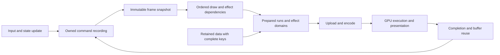

# Architecture for sustained mobile 60 fps

Status: planning and measurement, 2026-09-05. The 60 fps target is not achieved.
The runtime checkpoint is `f4b83bbf`, combining the renderer work through
`44e3ca4d` with owned recording. Publication merge `d61ac06a` adds the shared
bytemuck manifest requirement and measurement documentation with the same
application runtime. Main reference: `0d195313`. Fable and Codex reviewed this
plan together; `render_arch.md` retains the underlying experiment record.
Both working branches reached `77deb8fe`. Its gates pass, but the full-minute
watch Megaboss comparison fails acceptance: the shared runtime is slower than
main in the hot reverse-order legs. The PR must not land until this regression
and the remaining workload coverage are resolved.

## Contract and workload

Only Cranpose changes. Cranorbit Megaboss and Showcase keep their source,
resolution, effects, animation, density and release features. Both workloads
must sustain the physical display's 60 Hz rate on Huawei Mate 20 X and Pixel
Watch 3. Faster cold frames cannot compensate for slower sustained frames.
Every retained change must avoid an FPS regression against main and the last
accepted checkpoint in either application on either device.

Showcase acceptance means traversing the entire list, forward and backward,
with every body from Sun through Proxima Centauri b entering the visible region.
Header-only motion is a separate workload. On the watch, a 20 dp list margin
is 40 physical pixels at density 320. The previous gesture started at x=36,
outside that list; alternating direction also kept it around the header.
Dragging inside the unobscured list at (100,236) to (100,76) brings the Sun
and Mercury cards into view without an app change. Huawei accessibility queries and three screenshots confirm all 14 bodies across
launch and two forward swipes at (300,1500) to (300,600), 300 ms, with the
query interval allowing the fling to settle. Reverse coverage and a fixed timed
route still need verification. The watch traversal still needs semantic
checkpoints through the last card. The phone uses its own measured bounds, not
scaled watch coordinates.

Correctness covers live animation, input, draw order, clipping, blend order,
colour space, text, backdrop dependencies and resource lifetime. Existing exact
pixel expectations stay exact. Existing documented numerical bounds do not grow.
The CPU blur table differs from its per-pixel GPU predecessor by at most one
8-bit channel level in the 256-case Intel, lavapipe and Adreno probe; it passes
the unchanged CPU blur reference contract. It is not byte-identical and this
rounding fact must remain visible in the evidence.

## What the evidence establishes

| Workload | Evidence | Implication |
| --- | --- | --- |
| Huawei Megaboss | Earlier branch runs reach about 59.95 displayed fps | Preserve this result while fixing the watch; repeat on the combined build |
| Watch Megaboss | Integrated hot B A B A: 16.22 / 18.34 / 16.11 / 18.34 fps, B = shared runtime, A = main; 43.3–45.0 C | Acceptance fails; recover the lost performance before another runtime checkpoint is accepted |
| Watch Showcase header | About 21.7 ms GPU before CPU blur kernels; glass about 9.5–11 ms in removal experiments | Reduce useful shading work and redundant evaluation; this is not evidence about cards during full scroll |
| Huawei Showcase launch | Main 23.62 fps, checkpoint 3f948657 23.48 fps at 34 C | Earlier renderer changes provide no measured launch gain here |
| Huawei Showcase diagnostic | Removing glass leaves about 34 ms of a roughly 50 ms fenced frame; removing page operations leaves about 40 ms | A glass-only improvement cannot close the entire phone gap; fenced times are diagnostic and include lost overlap |
| Watch effect passes | Discard-at-entry blur passes about 0.04 ms each | A large rewrite justified only by pass-count overhead is unsupported |
| Parallel recording, compute raster, GPU expansion | Complete device prototypes lose performance or exactness | Do not repeat these designs based on an isolated microbenchmark |

These observations came from different revisions, temperatures and protocols.
Their savings cannot be added into a fictional 16.67 ms result. First establish
one frame timeline for the integrated code and the actual full-scroll route.

Removing only main's segment-surface cache gives 15.74 fps at 43.9–44.3 C;
re-enabling it in the next leg gives 17.95 fps at 44.2–44.7 C. The complete
A B A B then B A B A removal sequence is recorded in
`mobile_watch_performance.md`. The uncached result is close to the integrated
runtime's hot result, supporting lost segment reuse as a cause. Main's cache
also resamples rotating surfaces and permits a 200-level worst difference in
its rotation test. That implementation cannot be transplanted under this
plan's exact expectations. Recover its throughput with proven exact reuse or
lower-cost exact drawing, without weakening the tests.

## Frame budget and proof

A 60 Hz deadline is 16.67 ms. Use 13 ms as an engineering target for each
independently overlapped CPU-production and GPU-consumption path, leaving
scheduling and thermal headroom. This is a design budget, not a measurement.
If stages serialize, their durations add; if they overlap, their critical path
sets throughput. A short GPU timestamp span does not explain a long display
period by itself. Do not add queue/acquire waits to useful CPU work or sum
unrelated percentile samples.

Capture one frame identifier from input/update through scene publication,
encoding, submission, acquisition and presentation. Record useful CPU duration,
wait duration, upload bytes/calls, draw and vertex counts, shaded support,
GPU span where supported, and actual SurfaceFlinger presents. Huawei lacks
GPU timestamps, so use controlled removal diagnostics and matched app runs;
its standalone shell Vulkan probe cannot enumerate the app's adapter.
Fable's present-stage delay probe reports slack on the header workload: adding
5 ms does not produce a matching increase in period. This lowers the priority
of scheduling/encoding rewrites for that scene; retain the numeric report and
repeat attribution for full-scroll cards. Its four diagnostic legs report
38.6 / 41.4 / 42.8 / 44.7 fps at 37.6–39.6 C, with the first leg including
pipeline compilation. This is not an acceptance comparison or a complete
attribution of every millisecond of the display period. The probe is diagnostic
and must be absent from acceptance runs.

## One rendering representation, explicit reuse boundaries

The framework should describe stable drawing data, current-frame values and
sample dependencies separately, then lower that description to the device.
The public app drawing API remains the input. There is no app-name dispatch,
quality mode, stale-frame reuse or separate renderer implementation.

A cache entry owns both its resource and the proof of which inputs produced it.
Draw order and backdrop sample dependencies travel with the frame snapshot.
Buffer recycling follows completed ownership, including cancellation and surface
replacement, rather than a guess that the previous frame is finished.

## Ranked implementation tracks

### 0. Close measurement coverage and unexplained waits

Owner: Codex; Fable independently reviews the frame timeline.

Build both unchanged apps from the integration checkpoint. Establish full-list
routes at native density with visible semantic bounds, record first/middle/last
cards and return to the header. Run route discovery with accessibility queries;
keep that extra querying outside the timed interval. A route which never reaches
the final body is a failed workload check, regardless of its FPS. Add a robot
contract for the route/viewport geometry using the production composition where
available, and retain on-device evidence because desktop presentation is not the
watch GPU.

Run complete A B A B then B A B A sequences back to back. Log temperature before
and after every leg, with no cooling wait. Use equal builds, ABI, gestures,
measurement duration and scene start, stable PID and foreground. Retain hot
legs and report them. Count presents and frame-time tails, not only the app's
FPS overlay. Diagnose the same route in a separate run. Output: four workload
budgets and an attributed critical path. Subsequent priorities may change when
full-scroll evidence differs from the header.

### 1. Exact material output domains and static draw reuse

Owner: Fable, with Codex testing the resulting boundary and invalidation rules.

Runtime effects already declare input/output padding, substrate requirements
and split overrides. Extend this contract with a conservative output domain
when a framework material can prove it. Keep layout bounds, possible output
coverage and required input samples distinct. The tab-bar lens has deformation
headroom in its node bounds; that is not a requirement to shade every pixel
of those bounds on every frame. The renderer can clip/tessellate the proven
support while keeping its full source sample region.

The output proof must cover maximum wobble, glued neighbours, rounded corners,
rim glow, fractional scale, nonzero origins and scroll. A reduced domain which
clips even one permitted effect pixel is invalid. Use the existing SDF coverage
and specialization tests, add worst-case support cases, deliberately shrink the
bound to show them fail, then restore it. Estimated header opportunity is about
1 ms; full-scroll benefit is not yet known.

Static expensive draws need reuse below a whole command/layer: Showcase records
an unchanged opaque radial background and moving stars in one draw callback.
Caching that whole callback cannot hit. Plan stable ordered ranges with keys for
geometry, brush/stops, clip, placement, device scale/origin and target format.
Begin with provably opaque self-contained draws. Transparent draws and
backdrop-dependent output require their destination/sample dependencies and
cannot be treated as opaque cached pictures. Preserve the attachment's exact
blend and colour conversion; a cache blit must not add quantization or filtering.
Prove cold/warm byte equality and invalidation after every key input changes.
A cache admission policy must cover its lookup, allocation and copy costs;
changing inputs must not incur expensive cache churn. The previous ~1.8 ms
watch gradient estimate is a hypothesis to measure, not a promised gain.

### 2. Prepared dynamic runs, with publication outside the append loop

Owner: Codex; Fable reviews GPU costs and whether the work reaches the deadline.

Owned `CommandRecorder` and immutable `CommandRecording` already establish the
publication boundary. Body, curve, brush and placement columns already separate
changes, and stored runs already stage changed columns. Preserve those facts.
Measure the complete recording-to-submission interval, including allocation,
retained-reader reuse, scene traversal, brush remapping and uploads. Do not use
an append-only loop as the adoption test.

The next architectural decision is the lowering of dense changing runs. Compare
actual device costs of current instance records with a compact prepared vertex
stream generated from the same record representation, using the same fragment
coverage, order and hardware blending. This is a bounded feasibility experiment,
not a commitment to a second engine. It differs from the rejected GPU expansion
by testing total CPU preparation plus upload plus GPU consumption, with a vertex
stage that consumes prepared values. Only choose a lowering if it wins the full
critical path on both devices or a device-capability/cost rule reliably selects
the faster form without frame-to-frame oscillation. No hardcoded app threshold.

Retain all original argument bits on the CPU. Do not infer common rotation from
approximately equal angles or quantize motion. Keep cancellation, growth,
shrink, mixed primitives and retained-reader tests. Deliberately corrupt a curve,
record order and destination upload offset to prove the exact tests detect each
risk. SIMD may accelerate independent preparation only if it preserves operation
semantics and passes the same tests on ARMv7, ARM64 and wasm; parallel workers
must justify their complete scheduling and merge cost.

### 3. Schedule only after proving a serialization bottleneck

Joint decision after track 0. The current depth-one publication protocol protects
surface epochs, scene ownership and cancellation. Do not increase queue depth
just to make a throughput number look better while input latency grows.

If the timeline proves useful recording is blocked behind acquisition or a
resource which is no longer in use, separate CPU snapshot lifetime from GPU
buffer lifetime, bound outstanding work, and return ownership at the real
completion boundary. Keep ordered submission and current input. Prove surface
resize/replacement, cancellation, device error and shutdown under delayed
presentation. If the GPU itself exceeds the deadline, queue changes do not fix
it; pursue the identified shader or geometry cost first.

### 4. Reassess material execution from full-scroll evidence

Joint decision, with Fable owning effect compilation. Cards add animated planet
runtime shaders which the header runs never exercised. Attribute them separately
from glass and background draws before further shader work. Hoist only values
which are constant for the draw/material, as the blur kernel does. Keep spatial
coordinates, animation inputs, sample taps and original arithmetic dependencies.
Any wider material preparation or compiler specialization must have bounded
variant count, complete keys and no first-use compilation stall in a timed route.
Do not change source effect definitions or substitute a cheaper picture.

## Decisions rejected by joint review

Stage grouping based only on non-overlapping glass shapes is invalid: an earlier
composite can lie within a neighbour's expanded sample region. The existing
resolver already groups by those ordered dependencies. A looser grouping needs
a new proof, not a geometric guess.

Rendering glass interiors at a smaller grid and interpolating them is not an
accepted exact optimization. Refraction, dispersion and coverage are nonlinear;
the substrate's own lower resolution does not prove the final material is
band-limited. Such a prototype has no budgeted saving and cannot change any
existing comparison threshold. Likewise, rigid-motion reuse requires every
sampled source to be unchanged apart from that motion. Showcase's animated
stars and planets invalidate a broad claim that scrolling glass can simply
reuse its preceding image.

Huawei's measured glass cost alone, roughly 14–16 ms in prior diagnostics,
consumes most of a 16.67 ms deadline. That makes output support and invariant
material work central; it does not establish a physical lower bound for all
exact architectures. If the proposed exact changes leave a gap, record the
remaining measured cost and investigate its cause. The user has already ruled
out picture degradation, so reducing quality is not an implicit fallback or a
new approval question. The FPS requirement remains unmet until it is measured.

## Adoption and integration

Use `render/resolve-then-compose` and PR #617 as the publication branch.
`perf/mobile-watch-60fps` stays in its isolated worktree for Codex integration
and verification. Fable and Codex exchange reviewed committed units by merge;
Fable merges the verified integration checkpoint into the publication branch
for CI, then Codex incorporates that common head before the next unit. Both
compare against main and the last accepted checkpoint.
Shared device reservations and host locks prevent overlapping measurement.
No uncommitted teammate source is a build input.

Each unit finishes its architecture, public documentation, exactness proof and
regression mitigation before the next is stacked on it. Run the repository's
format, Clippy, test, Android, release web, budget, documentation, iOS and robot
recipes. Keep the CPU/GPU diagnostic logs and APK provenance with the results.
The final acceptance artifact contains complete route coverage, frame-time and
FPS comparisons for all four workloads, every leg's temperatures, unchanged
correctness expectations and the exact source SHA. Until that matrix passes,
report the measured gap rather than calling a partial speedup 60 fps.
