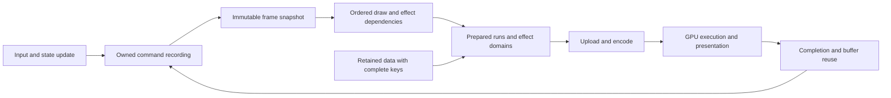

# Architecture for sustained mobile 60 fps

Status: architecture candidates under verification, 2026-09-06. The 60 fps target is not achieved.
Both working branches share `37bd0ce8`: the `a5710463` renderer, reference tests,
reviewed `36dab4ae` rim specialization, and the red-proven correction for stale
material overrides after re-specialization. Fable merged this common ground as
`82e829d5`. Activity and resting-substrate units remain separate on Fable's
branch. Activity passes exact pixel proofs but its paired speed results are
mixed, so it is held outside the shared checkpoint. Main reference remains the
freshly rebuilt `0d195313`. The shared watch Megaboss regression against main
is still an acceptance failure. `render_arch.md` retains the experiment record.

The next architecture decisions follow the measured critical paths:

| Boundary | Decision | Evidence required next |
| --- | --- | --- |
| Glass material execution | Use the existing finite specialization rules to remove only provably inactive work; preserve live sample coordinates and arithmetic | Activity exactness is proven on watch; repeat its mixed speed comparison against rim-only before adoption |
| Ordered shape execution | Keep the fixed-arc distance exit isolated; combine it with the held ordered-kind candidate only as a measured experiment | Native watch exact proof passes; finish automatic-policy Megaboss and full-scroll comparisons, then a fresh-main control |
| Frame publication | Retain the existing two outstanding packets, one active and one waiting | Watch Megaboss preparation exceeds the deadline with little idle time; retain queue depth and test preparation overlapping command production |
| Source capture | Retain the full declared input region for Regular glass | An output-conditioned bound must prove every live transmitted and opposite-side reflected sample, including filtering and capture phase |
| Shared acceptance | Keep app sources, native geometry and exact pixel contracts fixed | Finish the combined platform board and all four automatic-policy device workloads |

The independent pipeline-readiness and exact eight-sweep unit is committed as
`079c66f5` and merged with Fable’s `cc8a420b` layout repair in `a5710463`.
Immutable layout repair `528815a3` combined with that unit passes
the complete Linux workspace, native/wasm Clippy, release web and both CI robot
partitions, including all four framebuffer capture tests. Final reviewed layout
snapshot `ee467612` also passes 26 focused Linux atlas/glass tests and its padding
unit. Removing layout identity fails the shader probe; restoration passes with
source hashes verified. The 46-binary Metal renderer suite also passes; final
combined platform and device comparisons follow the shared merge.

The final pure `a5710463` snapshot subsequently passes `just test`, native,
wasm and Android Clippy, release web, release Android, and both CI robot
partitions on Linux, including all four framebuffer capture tests. The exact
iOS Clippy recipe also passes on Macm3. Source inventories are verified around
the Linux recipes. Huawei Megaboss favors this snapshot against freshly rebuilt
main in every pair. The subsequent phone full-scroll comparison also favors
shared, while watch Megaboss still loses 1.16% and 5.52% in the final hot pairs.
Watch full scroll favors shared in every pair, ending near 31.8 versus main
21.2 FPS. These gates do not establish the unmet 60 FPS target.

The two-owner storage experiment remains outside the active branch after a
Huawei full-scroll regression. The ordered kind-range candidate is isolated,
with exact pixel proofs passing on Macm3 and the watch. Watch proof counts are
two span tests, two pending-to-ready tests and five opaque-prefix tests. Its
eight-leg watch comparison ends with candidate 27.613/27.603 FPS and adjacent
main 28.609/26.069 FPS. One hot pair loses 3.48%, the other gains 5.88%. The
comparison does not establish the required absence of a regression, and the
candidate remains unaccepted.

The fresh-main versus independent-readiness watch Megaboss comparison fails
acceptance: the shared runtime is 11.522% and 9.739% slower in the hot reverse
pairs (25.063 versus 28.327 and 16.950 versus 18.779 FPS). PR #617 must not land
until this regression is resolved. Fresh-main full-scroll comparisons favor
the independent unit in every pair: approximately 29.7 versus 21 FPS on the
watch and 36.7–39.9 versus 26.1–29.0 FPS on Huawei. All eight legs on each device
pass full-route checks with forty timed gestures. These controls precede the
prefix/source/layout units; they do not establish final combined acceptance.
The target remains sustained 60 Hz in all four workloads.

A source-timestamp audit reproduces both Megaboss shared071 controls and the
watch Showcase control byte-for-byte. It does not reproduce the Huawei Showcase
shared071 control: Cargo had reused a previous native library. That specific
readiness full-scroll comparison is withdrawn as attribution evidence. Its
replacement uses the freshly reproduced control and favors readiness in all
four pairs by +0.787, +0.881, +2.247 and +0.663 FPS. The independent ownership-fix builds
recompiled the relevant framework crates in both ABIs.

## Contract and workload

Only Cranpose changes. Cranorbit Megaboss and Showcase keep their source,
resolution, effects, animation, density and release features. Both workloads
must sustain the physical display's 60 Hz rate on Huawei Mate 20 X and Pixel
Watch 3. Faster cold frames cannot compensate for slower sustained frames.
Every retained change must avoid an FPS regression against main and the last
accepted checkpoint in either application on either device. Current paired
matrices explicitly enable the presentation thread in both arms. They preserve
native picture settings but do not verify the automatic core-count policy,
which disables that thread below six cores; automatic-policy acceptance remains
required before claiming default behavior.

Showcase acceptance means traversing the entire list, forward and backward,
with every body from Sun through Proxima Centauri b entering the visible region.
Header-only motion is a separate workload. On the watch, a 20 dp list margin
is 40 physical pixels at density 320. The previous gesture started at x=36,
outside that list; alternating direction also kept it around the header.
The watch uses (100,236) to (100,76), 50 ms flings at 1.5-second cadence.
Twelve forward and twelve reverse steps reached Proxima and the header during
discovery, but two hot shared-runtime legs later stopped within the first card
on return. The replacement route uses sixteen steps each way and checks the
untimed return screenshot for the visible search field before timing starts.
All eight initial replacement-route starts pass. A later flat-background diagnostic misses one untimed return. The harness now allows up to sixteen additional reverse gestures, saves each attempt, and verifies the same search field before timing; it does not relabel that failed leg. Twelve visible
accessibility labels plus continuous video of Sun and Moon establish coverage
of all fourteen bodies; the video is route evidence, not an FPS measurement.
Huawei uses (300,1500) to (300,600), 300 ms, two forward and two reverse flings
at the same cadence. Its semantic checkpoints cover all bodies and the return.
Both routes preserve native resolution and density. Each acceptance leg includes
an untimed endpoint preflight followed by sixty seconds and forty gestures;
accessibility queries and video recording are absent from the timed window.

Correctness covers live animation, input, draw order, clipping, blend order,
colour space, text, backdrop dependencies and resource lifetime. Existing exact
pixel expectations stay exact. Existing documented numerical bounds do not grow.
The CPU blur table differs from its per-pixel GPU predecessor by at most one
8-bit channel level in the 256-case Intel, lavapipe and Adreno probe; it passes
the unchanged CPU blur reference contract. It is not byte-identical and this
rounding fact must remain visible in the evidence.

## What the evidence establishes

| Workload | Evidence | Implication |
| --- | --- | --- |
| Huawei Megaboss | Final pure shared-a571 holds 59.812–59.875 FPS against fresh main's 56.485–57.657 across all eight valid legs, 41–46 C | Every pair favors the combined build by 2.177–3.389 FPS; preserve it while closing the other workloads |
| Watch Megaboss | Final pure shared-a571 hot pairs: 25.701 versus main 26.003, and 25.686 versus main 27.187 FPS; 42.8–43.3 C | Acceptance fails; recover the lost performance before another runtime checkpoint is accepted |
| Watch Showcase full scroll | Final pure shared-a571 holds 30.011–31.823 FPS versus fresh main 14.363–21.261 across eight valid full-route legs, 41.6–42.5 C | Every pair improves, while the 60 FPS deadline remains unmet |
| Watch Showcase header | About 21.7 ms GPU before CPU blur kernels; glass about 9.5–11 ms in removal experiments | Reduce useful shading work and redundant evaluation; this is not evidence about cards during full scroll |
| Huawei Showcase launch | Main 23.62 fps, checkpoint 3f948657 23.48 fps at 34 C | Earlier renderer changes provide no measured launch gain here |
| Huawei Showcase full scroll | Final pure shared-a571: 40.182–41.486 FPS versus fresh main 27.029–27.332 across eight valid full-route legs, 42–45 C | Consistent improvement on the verified full route; the remaining deadline gap is substantial |
| Huawei Showcase diagnostic | Removing glass leaves about 34 ms of a roughly 50 ms fenced frame; removing page operations leaves about 40 ms | A glass-only improvement cannot close the entire phone gap; fenced times are diagnostic and include lost overlap |
| Watch effect passes | Discard-at-entry blur passes about 0.04 ms each | A large rewrite justified only by pass-count overhead is unsupported |
| Parallel recording, compute raster, GPU expansion | Complete device prototypes lose performance or exactness | Do not repeat these designs based on an isolated microbenchmark |

These observations came from different revisions, temperatures and protocols.
Their savings cannot be added into a fictional 16.67 ms result. First establish
one frame timeline for the integrated code and the actual full-scroll route.

Removing only main's segment-surface cache gives 15.74 fps at 43.9–44.3 C;
re-enabling it in the next leg gives 17.95 fps at 44.2–44.7 C. The complete
A B A B then B A B A removal sequence is recorded in
`mobile_watch_performance.md`. The uncached result is close to the integrated
runtime's hot result, supporting lost segment reuse as a cause. Main's cache
also resamples rotating surfaces and permits a 200-level worst difference in
its rotation test. That implementation cannot be transplanted under this
plan's exact expectations. Recover its throughput with proven exact reuse or
lower-cost exact drawing, without weakening the tests.

## Frame budget and proof

A 60 Hz deadline is 16.67 ms. Use 13 ms as an engineering target for each
independently overlapped CPU-production and GPU-consumption path, leaving
scheduling and thermal headroom. This is a design budget, not a measurement.
If stages serialize, their durations add; if they overlap, their critical path
sets throughput. A short GPU timestamp span does not explain a long display
period by itself. Do not add queue/acquire waits to useful CPU work or sum
unrelated percentile samples.

Capture one frame identifier from input/update through scene publication,
encoding, submission, acquisition and presentation. Record useful CPU duration,
wait duration, upload bytes/calls, draw and vertex counts, shaded support,
GPU span where supported, and actual SurfaceFlinger presents. Huawei lacks
GPU timestamps, so use controlled removal diagnostics and matched app runs;
its standalone shell Vulkan probe cannot enumerate the app's adapter.
Fable's present-stage delay probe reports slack on the header workload: adding
5 ms does not produce a matching increase in period. This lowers the priority
of scheduling/encoding rewrites for that scene; retain the numeric report and
repeat attribution for full-scroll cards. Its four diagnostic legs report
38.6 / 41.4 / 42.8 / 44.7 fps at 37.6–39.6 C, with the first leg including
pipeline compilation. This is not an acceptance comparison or a complete
attribution of every millisecond of the display period. The probe is diagnostic
and must be absent from acceptance runs.

## One rendering representation, explicit reuse boundaries

The framework should describe stable drawing data, current-frame values and
sample dependencies separately, then lower that description to the device.
The public app drawing API remains the input. There is no app-name dispatch,
quality mode, stale-frame reuse or separate renderer implementation.

A cache entry owns both its resource and the proof of which inputs produced it.
Draw order and backdrop sample dependencies travel with the frame snapshot.
Buffer recycling follows completed ownership, including cancellation and surface
replacement, rather than a guess that the previous frame is finished.

## Ranked implementation tracks

### 0. Close measurement coverage and unexplained waits

Owner: Codex; Fable independently reviews the frame timeline.

Build both unchanged apps from the integration checkpoint. Establish full-list
routes at native density with visible semantic bounds, record first/middle/last
cards and return to the header. Run route discovery with accessibility queries;
keep that extra querying outside the timed interval. A route which never reaches
the final body is a failed workload check, regardless of its FPS. Add a robot
contract for the route/viewport geometry using the production composition where
available, and retain on-device evidence because desktop presentation is not the
watch GPU.

Run complete A B A B then B A B A sequences back to back. Log temperature before
and after every leg, with no cooling wait. Use equal builds, ABI, gestures,
measurement duration and scene start, stable PID and foreground. Retain hot
legs and report them. Count presents and frame-time tails, not only the app's
FPS overlay. Diagnose the same route in a separate run. Output: four workload
budgets and an attributed critical path. Subsequent priorities may change when
full-scroll evidence differs from the header.

### 1. Exact material output domains and static draw reuse

Owner: Fable, with Codex testing the resulting boundary and invalidation rules.

Runtime effects already declare input/output padding, substrate requirements
and split overrides. Extend this contract with a conservative output domain
when a framework material can prove it. Keep layout bounds, possible output
coverage and required input samples distinct. The tab-bar lens has deformation
headroom in its node bounds; that is not a requirement to shade every pixel
of those bounds on every frame. The renderer can clip/tessellate the proven
support while keeping its full source sample region.

The output proof must cover maximum wobble, glued neighbours, rounded corners,
rim glow, fractional scale, nonzero origins and scroll. A reduced domain which
clips even one permitted effect pixel is invalid. Use the existing SDF coverage
and specialization tests, add worst-case support cases, deliberately shrink the
bound to show them fail, then restore it. Estimated header opportunity is about
1 ms; the initial lens-support A/B found no measurable app gain. Cover-mode
cards declare no support, so that candidate does not reduce their shading.

Output support and input sample domain are independent contracts. Input padding
limits reads outside the effect rect; it does not bound displacement from an
output pixel. A shader with tiny central output and padding zero may sample a
far corner inside the full input rect. Pruning its preceding blur to the output
rect is incorrect. Fable reproduced this with a failing GPU test and added
an explicit sample-domain declaration, defaulting to the full input. The liquid
material must not declare a narrower sample domain until zoom, refraction,
mirror and loupe reads have a proven bound. Keep the capture coordinate system
and downsample phase unchanged: changing them already caused one-level pixel
differences in an exact comparison.

Deformation support must use the absolute affine matrix applied to half-extents,
including off-axis strain. A 200-by-200 square strained by 2 and 0.5 at 22.5
degrees reaches 231.066 along x, beyond a scalar 204 declaration. Wobble, bulge
and coverage ramps also need the inverse-minimum-strain factor used by the SDF.
Fable reproduced both review failures before applying the corrected bounds.
A third red test pins repeated blur reads at capture edges: a wrapped axis
requires the opposite edge to be written too. Both declarations participate in
render identity. The corrected unit is committed as `6034b0de`; Huawei full
scroll shows no measurable gain or loss, and this exact tree remains unmeasured
on the watch.

Static expensive draws need reuse below a whole command/layer: Showcase records
an unchanged opaque radial background and moving stars in one draw callback.
Caching that whole callback cannot hit. Plan stable ordered ranges with keys for
geometry, brush/stops, clip, placement, device scale/origin and target format.
Begin with provably opaque self-contained draws. Transparent draws and
backdrop-dependent output require their destination/sample dependencies and
cannot be treated as opaque cached pictures. Preserve the attachment's exact
blend and colour conversion; a cache blit must not add quantization or filtering.
Prove cold/warm byte equality and invalidation after every key input changes.
A cache admission policy must cover its lookup, allocation and copy costs;
changing inputs must not incur expensive cache churn. The previous ~1.8 ms
watch gradient estimate is a hypothesis to measure, not a promised gain.

### 2. Prepared dynamic runs, with publication outside the append loop

Owner: Codex; Fable reviews GPU costs and whether the work reaches the deadline.

Owned `CommandRecorder` and immutable `CommandRecording` already establish the
publication boundary. Body, curve, brush and placement columns already separate
changes, and stored runs already stage changed columns. Preserve those facts.
Measure the complete recording-to-submission interval, including allocation,
retained-reader reuse, scene traversal, brush remapping and uploads. Do not use
an append-only loop as the adoption test.

The device ownership probe exposes a broken reuse boundary: the pool checks
only the outer `Rc`, while the present packet and stored GPU run still retain
the inner `Arc<ShapeRecorder>`. It takes the newest slot, allocates replacement
columns, and then rotates an empty slot into the spare. Of 1,408 large-command
acquisitions, 1,405 followed that path and only three reused storage. Requiring
both ownership layers to be free restores the existing two-slot cycle: the
removal probe reuses columns in 1,900 of 1,920 acquisitions. No extra buffer
count or deeper frame queue is needed. Tests must preserve held frame data and
clear all shapes and content markers before writing into a released recording.
These ownership counters are diagnostic. Default Megaboss comparisons are
effectively flat on both devices, but Huawei full-scroll B-minus-A pairs are
-0.293, -0.751, -2.819 and -2.780 FPS. The final hot pairs lose about seven
percent. The source and red-proven tests are stashed, and the fix cannot join
the shared branch until its complete-path regression is resolved.

The held experiment lowers long homogeneous shape spans to the existing
specialized coverage pipeline. Actual Megaboss recording contains five long arc
spans of 813–3,211 records within a mixed segment; a few foreign shapes prevent
the entire segment from selecting the arc pipeline. An exact watch probe with
15,007 captured arcs measures about 3–4.6 ms less submit-to-fence time with the
arc pipeline at 37.5 C. This is a feasibility bound, not app FPS.

The prepared iterator specializes only spans of at least 256 records and leaves
short interleavings together. It preserves original record order, fingerprints,
brushes, blending and strip geometry, and serves both retained and arena paths.
The exact GPU test covers overlapping translucent shapes, gradients, clipping,
fractional scale, changing record counts and the 128-record uniform-buffer
continuation used by the web fallback. Moving arc centres in a specialized
continuation makes 6,501 bytes differ; restoration passes. Misclassifying the intervening
rectangles as arcs makes 32,277 bytes differ; restoration passes. Complete app
A/B measurements decide whether extra draw calls, scanning and compilation
outweigh the shader saving. The full-minute app proof improves the final hot shared-runtime pair by about
11%, but remains 1.4–3.2% below main in the subsequent hot comparison. It stays
uncommitted. Review replaced repeated uniform-chunk prefix scans with a
persistent span cursor; the index/order mutant fails and both GPU paths pass.
The app matrices precede that repair, so its performance is still unmeasured.

Exact body interning is rejected: shrinking 960,448 body bytes to 78,972 costs
more GPU time and 16–23 ms of ARMv7 hashing. Fragment-stage template lookup and
full GPU vertex expansion also lose. A future representation must beat the
complete recording-to-submission and GPU path, with no approximate angles or
app-specific dispatch. Preserve one recording representation and measure a
bounded prototype before adding another lowering.

Retain all original argument bits on the CPU. Do not infer common rotation from
approximately equal angles or quantize motion. Keep cancellation, growth,
shrink, mixed primitives and retained-reader tests. Deliberately corrupt a curve,
record order and destination upload offset to prove the exact tests detect each
risk. SIMD may accelerate independent preparation only if it preserves operation
semantics and passes the same tests on ARMv7, ARM64 and wasm; parallel workers
must justify their complete scheduling and merge cost.

### 3. Schedule only after proving a serialization bottleneck

Joint decision after track 0. The current publication protocol permits two outstanding packets, one active
and one waiting, and protects surface epochs, scene ownership and cancellation. Do not increase queue depth
just to make a throughput number look better while input latency grows.

If the timeline proves useful recording is blocked behind acquisition or a
resource which is no longer in use, separate CPU snapshot lifetime from GPU
buffer lifetime, bound outstanding work, and return ownership at the real
completion boundary. Keep ordered submission and current input. Prove surface
resize/replacement, cancellation, device error and shutdown under delayed
presentation. If the GPU itself exceeds the deadline, queue changes do not fix
it; pursue the identified shader or geometry cost first.

### 4. Reassess material execution from full-scroll evidence

Joint decision, with Fable owning effect compilation. Cards add animated planet
runtime shaders which the header runs never exercised. Attribute them separately
from glass and background draws before further shader work. Hoist only values
which are constant for the draw/material, as the blur kernel does. Keep spatial
coordinates, animation inputs, sample taps and original arithmetic dependencies.
Any wider material preparation or compiler specialization must have bounded
variant count, complete keys and no first-use compilation stall in a timed route.
Do not change source effect definitions or substitute a cheaper picture.

## Decisions rejected by joint review

Stage grouping based only on non-overlapping glass shapes is invalid: an earlier
composite can lie within a neighbour's expanded sample region. The existing
resolver already groups by those ordered dependencies. A looser grouping needs
a new proof, not a geometric guess.

Rendering glass interiors at a smaller grid and interpolating them is not an
accepted exact optimization. Refraction, dispersion and coverage are nonlinear;
the substrate's own lower resolution does not prove the final material is
band-limited. Such a prototype has no budgeted saving and cannot change any
existing comparison threshold. Likewise, rigid-motion reuse requires every
sampled source to be unchanged apart from that motion. Showcase's animated
stars and planets invalidate a broad claim that scrolling glass can simply
reuse its preceding image.

Huawei's measured glass cost alone, roughly 14–16 ms in prior diagnostics,
consumes most of a 16.67 ms deadline. That makes output support and invariant
material work central; it does not establish a physical lower bound for all
exact architectures. If the proposed exact changes leave a gap, record the
remaining measured cost and investigate its cause. The user has already ruled
out picture degradation, so reducing quality is not an implicit fallback or a
new approval question. The FPS requirement remains unmet until it is measured.

## Adoption and integration

Use `render/resolve-then-compose` and PR #617 as the publication branch.
`perf/mobile-watch-60fps` stays in its isolated worktree for Codex integration
and verification. Fable and Codex exchange reviewed committed units by merge;
Fable merges the verified integration checkpoint into the publication branch
for CI, then Codex incorporates that common head before the next unit. Both
compare against main and the last accepted checkpoint.
Shared device reservations and host locks prevent overlapping measurement.
Build a committed revision or an explicitly shared immutable source snapshot
with a hash manifest. A teammate's changing working files are not build inputs.
Snapshot-based correctness proofs may precede a commit; adoption still requires
the complete proof, gates and device comparisons.

Each unit finishes its architecture, public documentation, exactness proof and
regression mitigation before the next is stacked on it. Run the repository's
format, Clippy, test, Android, release web, budget, documentation, iOS and robot
recipes. Keep the CPU/GPU diagnostic logs and APK provenance with the results.
The final acceptance artifact contains complete route coverage, frame-time and
FPS comparisons for all four workloads, every leg's temperatures, unchanged
correctness expectations and the exact source SHA. Until that matrix passes,
report the measured gap rather than calling a partial speedup 60 fps.

## Current next experiments

The next work is divided by measured cause, with each unit reviewed before it
joins the shared branch:

| Owner | Boundary | Evidence and implementation decision |
| --- | --- | --- |
| Fable | Opaque page prefix | Exact in-place capture and same-format reuse are committed as `e520addf`. Full-scroll cache-toggle means are 38.75 versus 41.88 FPS on Huawei; the watch's hot adjacent pairs gain about 2.1–2.2 FPS, with a negative thermal-crossing pair retained. Default combined-build acceptance against main remains required. |
| Fable | Backdrop admission and draw order | Commit `64107979` pins the original source atlas and sampling coordinates, with one budget/lifetime entry per allocation. Every backdrop awaiting capture blocks later drawing in its capture region. Exact focused comparisons, the full renderer suite and Clippy pass; the combined Linux workspace run follows integration. |
| Codex | Recording storage lifetime | The both-owner eligibility experiment restores 1,900/1,920 reuses and passes red-proven held-snapshot/clear tests, but loses about seven percent in Huawei's hot full-scroll pairs. It is stashed outside the active branch. Storage counters are insufficient adoption evidence. |
| Codex | Repeated arc calculations | The exact eight-entry half-sweep cache reduces the synthetic GPU-column-derived drawing/finish/reuse fixture by roughly 0.27 ms. This is a component measurement, not an original-argument app replay. Interleaving and eviction tests have deliberately wrong-slot RED and restored GREEN proofs. A larger radius/sweep template is rejected: even 98.18% hits increase that fixture from about 7.00 to 10.18 ms. |
| Codex | Pipeline readiness | Vulkan specialization compiles on a bounded worker while a correct general blend/tier pipeline draws. Pending-to-ready pixels are exact on watch and Linux. Shared-071 versus candidate Huawei Megaboss stays at about 59.9 FPS; hot watch Megaboss pairs are effectively flat near 25.1 FPS. The corrected Huawei full-scroll comparison favors the candidate in every pair by +0.663–2.247 FPS. Watch full scroll finishes at about 29.6–29.8 FPS on both arms, with the early thermal crossing retained. Main-versus-combined acceptance remains required. |

The clean watch profile, with expensive fill-area diagnostics disabled, has
about 21 ms UI update, 15.6 ms framework frame work and 24 ms GPU execution.
The recorded run-upload stage is about 2.0 ms; enabling fill-area estimates
adds about 4.4 ms of ARMv7 trigonometry to that stage. Instrumentation is
excluded from acceptance. A four-leg fragment-removal diagnostic reports GPU
medians 18.53/11.03/24.02/22.69 ms as the device changes clocks; its fifth leg
pauses before timing, so it is incomplete and establishes no accepted FPS gain.

Fable rejected the cards' split-draw geometry after the unchanged shader
reference exposed 788–1,407 changed pixels, each by one level; retaining
interpolated coordinates instead changed 18,510 pixels. Its 1.2% Huawei gain
does not justify that drift. The next ranked target is exact reuse of proven
opaque drawing within a mixed static/animated recording. Account for the
cache lookup and copy, and preserve complete invalidation keys.
Codex owns the remaining main-versus-span watch loss, complete full-scroll
coverage, and removal of optional shape-specialization compilation from an
active frame. Compilation already caused a 1,058 ms stall and an application pause.
A prepared general pipeline may serve a record until an exact specialization
is ready; never skip the draw. The device-lock feasibility probe passed: 234–276 complete render/fence cycles occur during each compilation, with 6.62–24.83 ms worst active frames. This is not app FPS. The implementation keeps one compiler active, at most one request queued and one result waiting for publication, deduplicates pending keys, cancels queued work when its renderer leaves, and keeps the existing frame queue depth. General lookup preserves blend, table tier and layout; a deliberately wrong blend makes 34,364 bytes differ in the transition test. Only optional shape specializations compile on the Vulkan worker. SrcOver general pipelines for both tiers are prepared at renderer construction; the essential general pipeline for another blend is still created synchronously on first use. That first-use cost remains a limitation. Web, Metal and GL keep their existing synchronous path. App measurements must still account for CPU contention and thermal behavior.

The vertex-kind and smaller-curve probes produce no stable one-millisecond
prize, so neither prompts a renderer rewrite. Every next prototype must target
an attributed cost and be rejected when the complete path does not improve.
The target remains sustained 60 Hz with the same pictures and applications.

### Execution boundary for the next larger recording experiment

The rejected parallel recorder gathered every input before starting workers.
It paid producer and preparation costs in sequence, then added metadata and
chunk handling. A streaming design is distinct only if a filled input chunk
starts preparation while subsequent draw calls are still producing records.
Its feasibility test must time that complete interval and preserve the public
draw API, original argument bits and global paint order. Prepared columns must
remain owned through publication and upload without a final concatenation or
a second per-record metadata scan. Small recordings and wasm still need one
coherent synchronous representation. This is a bounded investigation, not an
accepted implementation or a promised saving.

After the retention/order unit and pipeline unit share a tested commit, repeat
the four default workload comparisons against main before stacking another
renderer experiment. Retain any negative thermal-crossing pairs and frame-time
tails. Recovering main's throughput is a gate; reaching a sustained 16.67 ms
display period remains the goal.

### Dynamic drawing after the ownership fix

The next bounded comparison is between the held renderer-side span iterator
and discovering the same long homogeneous ranges while recording. A semantic
segment must retain its blend, brush class, content boundary and original band
class. Kind ranges may choose an exact specialized shader inside that segment;
they must not change its strip geometry or reorder short intervening shapes.
Producing this metadata alongside append could remove the later scan, but adds
work to every draw call. Compare complete recording, publication, preparation
and upload costs before choosing either boundary. Do not infer a gain from the
number of scans removed.

Use the existing captured arc stream and mixed-shape GPU proof. Exercise growth,
shrink, held readers, content boundaries, fractional clipping, brush changes
and uniform-buffer continuation. Deliberately corrupt the selected kind and a
continuation offset to establish that the picture tests fail. Preserve source
argument bits and the original segment band class in both designs. Only after
those checks pass does a default app comparison decide whether the additional
draws improve the hot main comparison. Streaming workers remain a separate,
lower-priority experiment until this measured path is resolved.

### Current isolated kind-range verification

A refreshed prototype preserves the opaque-prefix record-window contract in both retained and arena uploads. Relative run windows are applied to absolute table segments before a persistent cursor traverses 128-record continuations. It retains the original semantic band class, draw order, blend and gradient facts. Tests include noncontiguous segment starts and windows inside specialized ranges. GPU comparisons wait for actual specialization and check every intervening frame. On Macm3, removing the window start trim makes the unit proof fail; assigning the wrong shape kind makes the pixel proof fail. Restored unit, span, variant and prefix tests pass. Unchanged Orbit and Showcase binaries are built from immutable layout528/readiness control and kind-range candidate inventories in both Android ABIs. This candidate is isolated outside the active worktree. The watch passes both span tests, both pipeline-transition tests and all five prefix tests. Default app FPS and the remaining combined correctness gates decide adoption.

A conservative strip-bounding-box census rejects zero of the 15,161 records in the captured Megaboss frame. It scales radii before adding the one-device-pixel margin. This only tests bounding boxes, not exact triangle intersection, and provides no measured saving for a culling rewrite.

### Record construction boundary after the shared merge

The current kind candidate's clean CPU sample attributes 11.79% self cycles to
`push_arc_band`, 10.59% to `push_shape`, 4.34% to `normalized_band`, and 1.51%
to `sincosf`. Its emitted ARMv7 code builds a 112-byte ShapeRecord on the caller
stack, calls `push_shape`, then copies the body and curve through another stack
temporary before writing the owned columns. This is a concrete repeated-data
boundary, distinct from allocation reuse and shader work.

The isolated one-attribute inline experiment removes that call in the ARMv7
binary and reduces the caller's local stack space from 160 to 144 bytes. Both
graphics suites and the final combined Metal span, variant and prefix pixel
tests pass. Its complete watch ABAB/BABA comparison gives hot B-minus-A pairs
of -0.081719, -0.026003 and +0.032120 FPS near 27.6 FPS. The early thermal
crossing loses 6.705025 FPS and remains in the evidence. The change has no
measured gain and is rejected. Removing the call boundary does not justify a
larger direct-column rewrite. Worker queues would additionally pay input
ownership and publication costs; they still require a complete-path prototype.

The previous GPU-column-derived CPU fixtures are synthetic, not original-argument
replays. Use actual ArenaRenderer calls or a complete source capture for the
next producer experiment. The fragment radius-hoist probe is rejected after
24 channel bytes differ at scale 1.25 on the watch; shader-stage changes must
pass the same fractional-scale pixel contract before timing or integration.

A second conservative census tests the captured rings against radial clip bounds. None of the 15,161 arc records has the viewport entirely inside its hole or outside its outer radius, so it supplies no culling opportunity. Only 15 full GPU records are duplicates; no duplicate-work optimization is supported by that count.

### Consecutive-frame data and the next ownership decision

A new census calls the unchanged application's `ArenaRenderer` and `GameSession`
at 204 by 204 logical pixels and density 2. It compares actual consecutive
recordings, including all primitive kinds, after one second of warm-up. This
is a data census at fixed update rates, not a device FPS measurement.

| Update rate | Frames | Entire body column unchanged | Equal bodies at the same index | Body bytes requiring current 4 KiB uploads | Curve bytes requiring uploads |
| --- | --- | --- | --- | --- | --- |
| 60/s | 540 | 51 | 46.77% | 62.19% | 85.33% |
| 20/s | 180 | 2 | 44.12% | 65.62% | 92.25% |

`RunBuffers::write_changed` already compares 4 KiB chunks and joins adjacent
changed chunks. Both body and curve copies have a median of one range per
frame. `CommandRecorder::reusing` retains free capacities but `finish` creates
a new recorder `Arc`; its pointer fast path applies to an unchanged published
recording, not to a freshly recorded generation. Sharing a body-column identity
would still require proving equality while constructing those generations.
The census does not support treating dynamic Megaboss as angle-only drawing,
and moving the same comparison into recording does not by itself remove work.

The captured 15,161-arc stream also alternates butt and round caps across 4,259
ranges, none longer than twelve records. Additional cap-specific draw calls
have no long homogeneous ranges to exploit. No cap specialization or broad
body-column cache is proposed from this evidence.

### Glass tap gates under device verification

Fable's isolated `7f306f6b` gates the plain backdrop sample and the five-tap
reflection path by their existing output weights. It retains the plain sample
for either resting or outer output; reflected outer colour does not feed the
face colour. Explicit texture sampling has no implicit derivative dependency.
Independent review finds no finite-input gate error. Frozen-reference tests
pass on Metal, and three live-tap removal mutants fail before restoration.
On Adreno, all five reference tests pass, all five fail when live reflection
taps are removed, and all five pass after restoration. Linux repeats the same
fixed/broken/restored proof with verified source inventories. The native watch
log retains wgpu's unconditional warning that the adapter lacks
`DEPTH_BIAS_CLAMP`; that capability is not used by these tests. Full-scroll FPS
rejects this unit: all four watch pairs lose, with the
stable hot pairs losing 1.75–2.21 FPS; Huawei pairs are mixed. Fable removes the
gates in `1581e056` while retaining the stronger reference scene. The independent
rim-style specialization `36dab4ae` uses the existing override mechanism and
remains under device verification. Runtime branch cost is a hypothesis consistent
with the regression, not a measured attribution of the lost time.

## Arc coverage feasibility boundary

The arc candidate returns the existing butt-cap plane distance before the
radial distance calculation when that plane is at least 0.5 device pixels. The original
function finishes with the maximum of that plane and its radial distance, so
normal finite inputs in the early-return domain already have zero coverage and
are discarded. Live fragment equations and every non-butt path remain intact.

An Adreno probe on 15,007 captured arcs preserves every channel byte for mixed
caps and forced butt, round and square caps at four scales. Moving the threshold
to -1 changes 39,864 channel bytes; restoration passes. Its short timing legs
vary substantially and lack per-leg wake-state verification, so they do not
establish an app gain. A follow-up
probe explicitly wakes and verifies the watch before and after each timing leg,
and includes both general and fixed arc pipelines. With all wake checks passing,
the general pipeline saves 0.165–0.492 ms in every pair. Fixed-kind pairs are
+0.344, -1.922, -0.368 and -0.230 ms (candidate minus baseline), including the
first loss. All 16 pixel cases per pipeline and timed captures remain exact.
These are feasibility timings, distinct from the completed application runs.

The repository regression compares full shader output against a frozen copy of
only the original arc distance function. It covers thin and wide strokes, cap
styles, clipping, fractional scales, both pipeline kinds, and translated edge
positions aligned near the conservative rejection boundary. Baseline passes,
the threshold mutant fails on pixels, and restoration passes on Linux and Metal.
The tessellation test retains its original exact comparison. The committed
test-only unit is merged into Fable's branch as `862cd459`; the
production arc shader remains unchanged on the Codex branch.

The complete watch Megaboss sequence favors the candidate by 0.407, 0.479 and
0.419 FPS in the three hot pairs, with an initial thermal-crossing loss retained.
Huawei Megaboss stays at the display cap with differences below one frame over
sixty seconds. Huawei full scroll has two positive and two negative pairs:
+0.169, +0.615, -0.680 and -1.541 FPS. This does not pass the no-regression gate.
The candidate remains isolated. A bounded follow-up can restrict the exit to
the existing fixed-arc pipeline, leaving mixed general drawing unchanged; it
must prove that isolation and repeat the whole application comparisons.
Neither these results nor the held kind-range results establish recovery
against main.

## Field reuse does not justify a recording rewrite

A field census uses the unchanged application's actual producer at fixed
60/s and 20/s update rates. Splitting the current body/curve representation
into three proposed groups saves only 1.273% and 0.189% of estimated upload
bytes respectively. Six independent 16-byte groups have a larger ceiling,
17.423% and 16.944%, but their added append, comparison and binding costs
remain unmeasured. These byte counts do not establish time saved. The three
groups do not justify a public recording-layout rewrite, and the six-group
idea requires a complete-path prototype before adoption.

The captured frame has no consecutive identical geometry when colour is
excluded. Its fifteen duplicate geometries are separated in draw order, so
combining successive equivalent paints does not offer a supported shortcut.

## Draw-wide material specialization

The rejected runtime tap gates are not a basis for changing output equations.
Fable's isolated rim-style override uses the existing pipeline constants; the
Huawei full-scroll sequence favors it in all four pairs. On Adreno, all five
frozen-reference tests pass, a deliberately unconditional rim-style-off mutant
fails the live lens scene, and all five pass after restoration. The completed watch sequence has three hot gains of 5.22–5.24 and 5.03 FPS,
with candidate legs near 36.6–36.9 FPS. Its first thermal-crossing pair loses
4.56 FPS and remains in the record. This supports the material-path saving
on both devices; final integration against main and the 60 FPS target remain
open.

A further hypothesis freezes fully active material state at the draw boundary.
Only if the existing interior discard margin proves coverage is exactly one
may that pipeline specialize the coverage result and eliminate zero-weight
work at compilation. Resting cards retain their feathered coverage. The proof
must cover fractional scale, deformation and the minimum ramp width, followed
by a deliberately broken reference test and complete device comparisons. This
is an experiment within the existing override architecture, not a new shader
compiler or an accepted speedup.

## Current measurement ownership and timeline

The arc-only follow-up's first Huawei sequence is ineligible after a second
team driver installed and exercised Showcase during the intended uninterrupted
comparison. All original readings remain recorded. Repeat all eight legs
under a shared per-device sequence lock; per-leg process and route checks
do not establish this stronger contract. The activity specialization runs
next, followed by the repeated arc comparison.

An isolated diagnostic snapshot carries each packet's producer update start,
publication return, consumer acquisition start, render end and present-call
end on the same monotonic clock. Worker start can precede publication return,
so report handoff bounds instead of a false exact wait. Measure overlap between
adjacent frames' producer and consumer spans. Present-call completion remains
distinct from SurfaceFlinger presentation, and elapsed renderer spans may
include submission backpressure. These diagnostics do not join the application
FPS builds or justify a deeper frame queue on their own.

### Huawei packet timelines and fixed-arc repeat

The uninterrupted fixed-arc-only full-scroll repeat uses the whole-sequence lock.
Its shared/candidate/shared/candidate/candidate/shared/candidate/shared readings
are 38.254701, 39.555355, 39.439090, 39.528839, 40.770413, 40.066477,
39.075233 and 37.902089 FPS. Each sixty-second leg completes forty gestures.
Temperatures before/after are 38/38, 37/38, 38/38, 38/38, 39/38, 39/40,
40/40 and 39/39 C. All four candidate-minus-control pairs are positive:
+1.300654, +0.089749, +0.703936 and +1.173144 FPS. This replaces the
interfered sequence as attribution evidence; watch acceptance remains open.

Four separate diagnostic runs instrument pure `a5710463`, without the rim unit,
using the same producer and consumer clock. These runs also enable profiling;
they are not an acceptance comparison. Per-packet medians are:

| Workload / presentation worker | Update | Acquire | Render execution | Present call | Actual diagnostic presents |
| --- | ---: | ---: | ---: | ---: | ---: |
| Huawei full scroll / on | 3.896 ms | 0.371 ms | 6.018 ms | 17.492 ms | 37.825 FPS |
| Huawei full scroll / off | 4.316 ms | 0.396 ms | 6.430 ms | 12.717 ms | 37.623 FPS |
| Huawei Megaboss / on | 6.085 ms | 12.547 ms | 1.573 ms | 1.317 ms | 59.906 FPS |
| Huawei Megaboss / off | 6.106 ms | 7.704 ms | 1.549 ms | 0.935 ms | 59.912 FPS |

The scroll producer is short relative to the display period. The consumer spends
substantial time in presentation, which can include GPU or compositor backpressure;
this does not establish its exact cause or turn that time into CPU work. The
worker-on scroll handoff has median lower/upper bounds of 11.595/12.090 ms.
Increasing queued work would not make the measured consumer faster. Continue
material execution work while the watch timeline resolves its different budget.
Do not sum these medians into a synthetic frame or use them as GPU timestamps.

The worker-on scroll log omits 132 packet IDs in four intervals. The analyzer
records those gaps and excludes cross-gap period, latency-overlap and producer-gap
statistics; individual observed packets retain their own valid spans. A missing-ID
self-test fails before this guard and passes after it. Synchronous logs have no
packet IDs, so they cannot prove adjacent frames or support stall-tail claims.
The synchronous Megaboss log has far fewer samples than actual presents and an
apparent 8.77-second gap; that gap is not evidence of a stalled application.
Raw logs, source inventories and independent SurfaceFlinger counts are retained.

### Regular glass source reach

Zero input padding is not a per-output sampling radius. The transmitted path
can move a sample towards the optical center, and the live bevel reflection
can read the opposite side of the surface. `rim_style == 0` removes the meniscus
reflection but leaves the bevel's 0.035 coefficient. An active interior proof
can remove zero-weight outer output for that pipeline; it cannot remove the
rim's live reflected source. Adaptive neighborhoods add their own filter reach.
The current single rectangular sample domain does not represent independently
clamped source pieces. A smaller capture or blur region is unsupported until
an output-conditioned bound preserves all taps, clamp edges and capture phase.

The activity unit `22aece9d` passes the native watch frozen-reference proof:
five fixed tests pass; forcing activity on for resting glass fails with 35,868
differing pixels; removing the resting guard from the interior output fails
with 257 differing pixels; restoring the unit passes all five tests. The same
fixed/two-mutant/restored sequence passes on Metal and Linux. Watch performance
is measured separately against rim-only; the proof does not establish speed.

## Watch timelines select the preparation boundary

The `frame-trace-a571` diagnostic stamps producer update, publication, target
acquisition, renderer execution and present calls on the same monotonic clock.
The following are medians of individual spans, not additive stage percentiles
or GPU timestamps. Logs come from separate runs at the reported temperatures;
these runs cannot establish a causal comparison of presentation policies.

| Workload / presentation worker | Battery C before → after | Update ms | Renderer execution ms | Present call ms | Actual displayed FPS |
| --- | --- | ---: | ---: | ---: | ---: |
| Watch Megaboss / enabled | 43.2 → 44.6 | 43.862 | 11.295 | 47.331 | 16.800 |
| Watch Megaboss / disabled, resumed | 41.9 → 43.6 | 39.129 | 7.437 | 4.363 | 19.396 |
| Watch full scroll / enabled, resumed | 43.7 → 43.7 | 12.841 | 21.908 | 48.963 | 15.386 |

The synchronous Megaboss trace has only 0.385 ms median between the previous
packet ending and the next update starting. Correcting a missed-callback
period cannot remove its measured preparation work. The full-scroll worker
trace has a 44.424–45.439 ms median bound on publication-to-consumer handoff;
presentation and rendering are backpressured. Renderer execution includes
possible submission waits and must not be called pure GPU cost. The enabled
worker logs have contiguous packet IDs. Synchronous logs have no packet IDs,
so absence of a logging gap cannot be proven from their cross-frame spans.

The first synchronous watch Megaboss trace lost foreground during an ADB
disconnection and is invalid. The resumed synchronous full-scroll trace failed
its untimed return-to-search-field check and never entered measurement. Both
reports remain retained. Three valid traces do not constitute a completed
four-case timeline matrix or automatic-policy acceptance.

A separate Huawei full-scroll removal probe substitutes the panel's observed
16,666,666 ns period for the callback-delta fallback. All eight legs verify that
panel period and forty swipes. Display-period minus callback-period paired
results are -0.844, +2.464, +2.755 and +0.449 FPS, at 37–39 C. This mixed
attribution does not justify a production scheduling rewrite. The diagnostic
property and frame tracing remain absent from shared source.

The next preparation experiment owns incoming draw arguments inside a framework
`DrawScope` adapter, sends filled chunks while the unchanged producer continues,
and publishes ordered immutable chunk owners after terminal completion. It
must measure the entire producer/preparation/publication interval. It must not
precollect a static stream, concatenate output columns, infer common rotation,
or hide later per-chunk renderer costs. Text measurement remains synchronous;
text's non-Send `Rc<str>` stays on the producer. A borrowed draw scope does not
prevent sending a separate owned chunk to a worker. Full event replay, retained
readers, content boundaries and deliberately reversed completion order are the
correctness gates before any device feasibility claim. No production recorder
change has been accepted from this investigation.

The apparent duplicate `WithContent` recording is not the active apps' path:
Cranpose's `Canvas` uses `draw_behind`, and the unchanged Orbit and Showcase
sources do not call `draw_with_content`. Removing that duplication cannot be
presented as a fix for these profiles.
